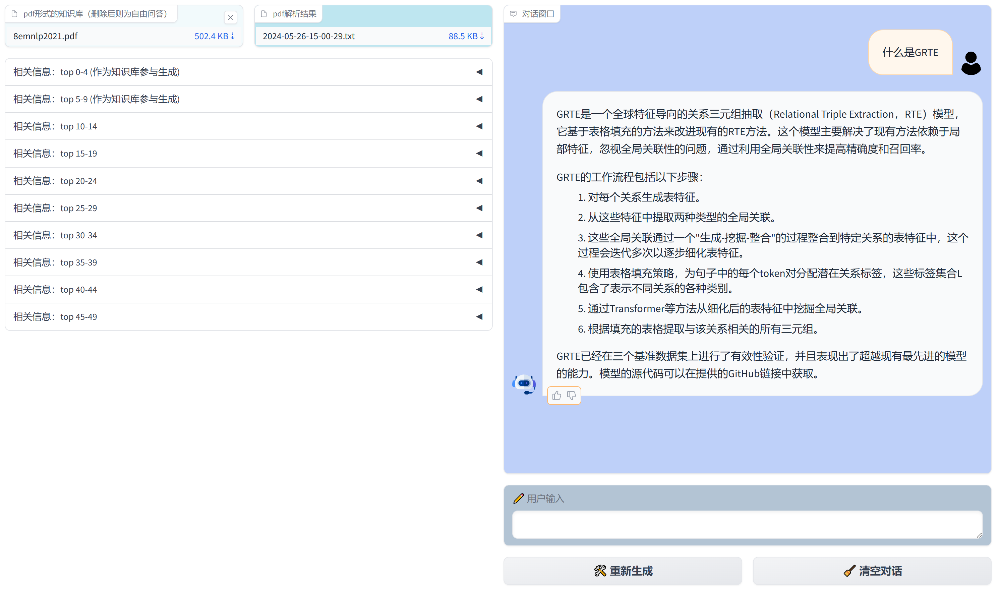

# 问答问答系统

## 技术路线
- 前端：gradio
- 后端：RAG

## 直接运行

- 环境安装
```bash
pip install -r requirements.txt
pip install torch==2.2.1
```

- 运行
```bash
CUDA_VISIBLE_DEVICES=0 python chat.py --llm_path Qwen1.5-7B-Chat --rerank_path bge-reranker-v2-m3
```

- 访问 http://127.0.0.1:7860/ 即可

## Docker运行
```bash
# 从阿里云将文档问答系统的镜像拉取到本地
docker pull registry.cn-hangzhou.aliyuncs.com/zhanglonghui/docqa:v1

# docker运行
# 下载到本地的Qwen1.5-7B-Chat路径
qwen_model_path=""
# 下载到本地的bge-reranker-v2-m3路径
rerank_model_path=""
# gpu
device="0"

docker run --gpus device=${device} -v ${qwen_model_path}:/usr/src/app/Qwen1.5-7B-Chat -v ${rerank_model_path}:/usr/src/app/bge-reranker-v2-m3 -p 7860:7860 docqa

# 通过端口7860对demo进行访问
http://localhost:7860

# 可能的报错及解决方案：
# docker run ... 如下报错时，参考教程 https://zhuanlan.zhihu.com/p/373493938
# docker: Error response from daemon: could not select device driver "" with capabilities: [[gpu]].
```

